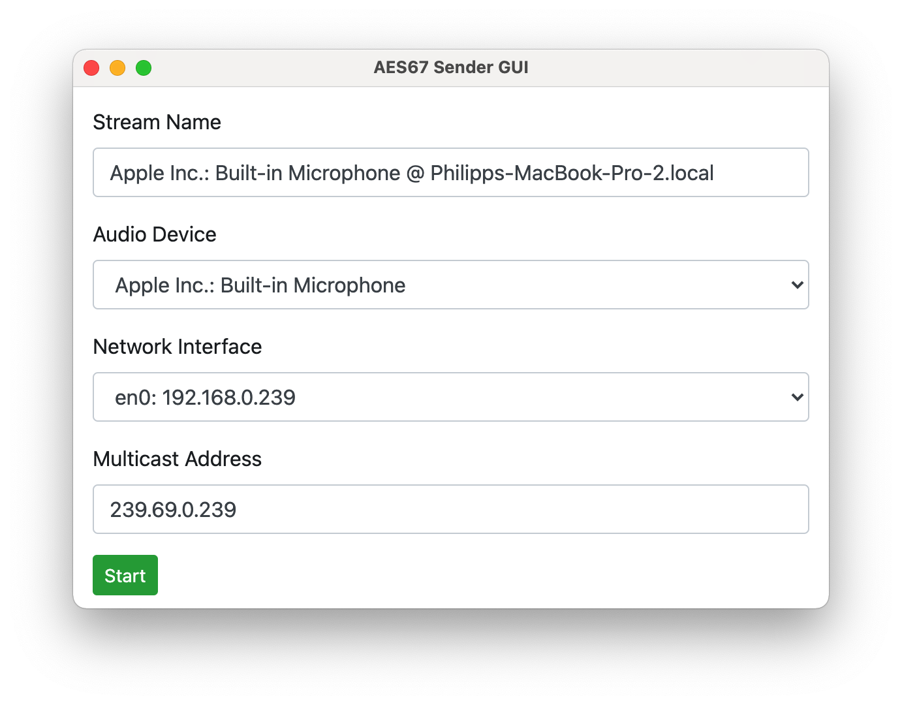

# AES67 Sender GUI
Cross plattform app to provide a local soundcard input in a AES67 network. This app is under early development.

Here is a screenshots of how the app looks:


## Installation
```
git clone https://github.com/philhartung/aes67-sender-gui.git
cd aes67-sender-gui
npm install
```
The app should then be installed.  Audify (audio backend used) prebuilds are available for most major platforms and Node versions. If you need to build Audify from source, see https://github.com/almogh52/audify#requirements-for-source-build.

After installation you can start the app with `npm start`.

## Building
To build a binary for your system, first install the app and then run:
```
npm run build
```
This will create a folder for your platform and CPU architecture, containing the binary.
 

## License and copyright notice
This repository contains code under the MIT License from [twbs/bootstrap](https://github.com/twbs/bootstrap).
